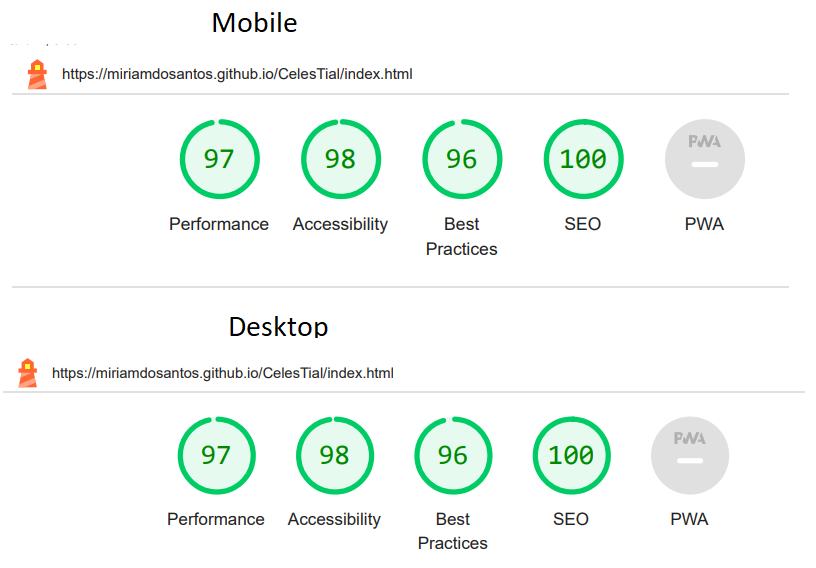

# CelesTial

The CelesTial website is an enchanting online sanctuary dedicated to mystical services and celestial exploration. 

CelesTial is here to offer a captivating online experience, providing mystical services and celestial insights to empower and inspire.

Designed for those intrigued by the mystical, seeking guidance, and inspiration from the celestial realm.

Users will find a variety of mystical services, including tarot readings, palmistry, and astrology consultations, tailored to offer guidance on love, career, and personal growth. Additionally, there is a convenient contact form for inquiries, bookings, or assistance. The site is responsive, adapting seamlessly to all screen sizes.

---------
## Features

The webiste is comprised of 3 pages, three of which are acessible from the navegation menu (Home, Services, Member) for the last a Code institute Congratulations submition form.
* All pages on the webiste have:
    * Clear Navigation: Easily navigate through different sections of the website, including Home, About, Services, and Contact, situated to the right.
    * Responsive Design: Navigation bar adapts gracefully to various screen sizes, ensuring optimal usability whether you're browsing on a desktop, tablet, or mobile device situated in the burger-icon that expands when you click it.
    * The header: At the top left in the header section, there is the website logo, that will take the user to the home page when clicked.
    * The website logo and sets the main color theme; Rich black, Claret and Caramel, and a favicon was personalized create.
    
    * Dynamic Footer: the website boasts a dynamic footer section that provides essential links, such as social media profiles, contact information, and additional resources, ensuring easy access to relevant content and enhancing user engagement.
    
    * The home page
    * The website features an engaging homepage designed to captivate visitors from the moment they arrive. With stunning visuals, concise messaging, and intuitive navigation
    
    *The section About: highlighting its role in introducing visitors to CelesTial's purpose and inviting them to engage with its mystical offerings. 
    

* The Services page    
    * Discover the diverse range of mystical services tailored to guide you on your journey of self-discovery and enlightenment. From tarot readings to astrology consultations, the experienced practitioners are here to offer clarity and support and contain the location and operation time. 

    * Apresentation of the Services offers as a card: **Tarot Reading**, **Palm Reading**, **Cristal Ball** and **Daily Horoscope**. Each service is accompanied by an eye-catching, realistic image to visually represent it. Beneath each image, the user will find concise paragraphs containing the essential information and details about the service. Additionally, the price of each service is clearly displayed for easy reference. At the bottom of each service description, users will find a button featuring a creative and inviting phrase. Clicking on this button will redirect you to the member page, where you can contact us, choose your desired service, and easily apply for it.
    
    Furthermore, the layout of the services section has been optimized for responsiveness using CSS Grid. This ensures that the services are displayed in varying numbers of columns, depending on the screen size, providing an optimal viewing experience across different devices." 
     * Testimonial Cards: Each testimonial is accompanied by a captivating image, adding a personal touch to the feedback. Beneath each image, you'll find concise paragraphs containing the testimonial itself, along with the name of the satisfied customer. Additionally, we've incorporated a star rating system to provide a quick visual representation of their satisfaction level.  
    The layout of the testimonial section is designed for optimal viewing across different devices. 
    Using CSS Grid, the testimonials are displayed in a visually appealing format, adapting seamlessly to varying screen sizes. This ensures that visitors can easily read and engage with the testimonials, enhancing their overall experience on the website.
      
    * Location section: The location section offers users vital details about the physical presence. A visually engaging map presents our exact location, ensuring clarity for users. Below the map, concise text provides essential information such as our address, contact details, and operating hours. Additionally, a captivating video further enhances the user experience, offering insights into our location and facilities.
    The layout of the location section is meticulously designed to adapt seamlessly across various screen sizes. Whether accessed on a desktop, tablet, or mobile device, users can effortlessly access the location information and video, facilitating convenient navigation and planning for their visit.
      
    * Member page
    * The Member Page serves as a personalized hub where visitors can explore a diverse range of mystical services and celestial insights. Designed with a clean and intuitive layout, with a picture of Celeste on the baground it offers a seamless browsing experience, guiding users through the enchanting offerings available, with a form to apply for it.  
    The layout, crafted using responsive design principles, ensures optimal viewing across various devices, from desktops to mobile phones.
    

 ### Features left to implement
 * I would like to add a dropdown menu with services available;
 * I would like to add a payment method on the page. 
 --------- 
 ## Testing
 * Accessibility
    * I used Lighthouse within the Chrome Developer Tools to allow me to test the performance, accessibility, best practices and SEO of the website.And confirmed that the colors and fonts are easy to read and that the site is accessible.  
    * **INDEX PAGE**
      
    * **SERVICES PAGE**  
      
     * **Member PAGE**  
      
* The website was tested on Chrome, Mozilla, Edge and Safari browsers with no problems found.
* Links: Tested and confirmed that each link refer to each page, worked as expected,and redirecting the user between the pages
* Tested all  links, to social media sites leading to external pages opened correctly in a seperate browser tab.
* I tested and confirmed that the Member form works, all fields are required, the check buttons one of them is checked, and  the email field only accpect email, and the apply buttun works perfectly in the end to submit the form, with a messa back from Code Institute. 

* HTML  
    * [HTML Validator](https://validator.w3.org/#validate_by_upload) was run each page of the project, and small syntax errors identified were fixed. At the final stage no errors or warnings were found.
    
* CSS  
    * [CSS Validator](https://validator.w3.org/#validate_by_upload) was run each page of the project, and small syntax errors identified were fixed. At the final stage no errors or warnings were found.
    
---------
## Bugs
* Initially, positioning the header with navigation correctly across different media sizes posed a challenge, resulting in duplicated lines. However, this issue was resolved after examining the use of relative measures in the width and height of elements.

* Relative measures were also applied to image sizes, divs, and sections across all pages, as suggested and explained by the tutor to enhance responsiveness.
---------   
### Unfixed Bugs
All bugs identified were fixed

## Deployment    
### Versin Control

 * The site was created using VS Code as IDE and pushed to Github to the remote repository 'CelesTial'.
 * Git commands were employed extensively during development to push the code to the remote repository. The sequence of Git commands utilized includes:
    * **git add .**: This command adds the files to the staging area, preparing them for commitment.
    * **git commit -m "commit message"**: It commits the changes to the local repository queue, marking them as ready for the final step.
    * **git push**: This command is executed to push all committed code to the remote repository on Github.  
    ### Deployment to Github pages
    The site was deployed to GitHub pages. The steps taken to deploy are as follows:
    1. Log in to [Github](https://github.com/);
    2. Navigate to [miriamdosantos/CelesTial](https://github.com/miriamdosantos/CelesTial) in the list of repositories;
    3. In the GitHub repository, navigate to the Settings tab;
    4. In Settings scroll down to GitHub pages which opens in a new page;
    5. From the source section drop-down menu, select the Master Branch;
    6. Once the master branch has been selected, the page is automatically refreshed and a display indicates the successful deployment and the link to the address.  
    ### Cloning Repository Code locally
    * To clone the repository code locally, follow these steps:
    1. Navigate to the Github repository you wish to clone;
    2. Click on the "Code" button located above all the project files;
    3. Select "HTTPS" and copy the repository link;
    4. Open the IDE of your choice and paste the copied git URL into the IDE terminal;
    5. Press Enter to execute the command;
    6. The project will now be created as a local clone in your IDE.
    --------- 
    ## Wiframes
    * The site was developed with the Desktop layout  method first. The wireframes were therefore drawn with that thought in mind and adapted along of the project, and created with [Balsamiq](https://balsamiq.cloud/) . First picture: Home page, Second picture: Services page, Third picture: Member page.
    
    
    

